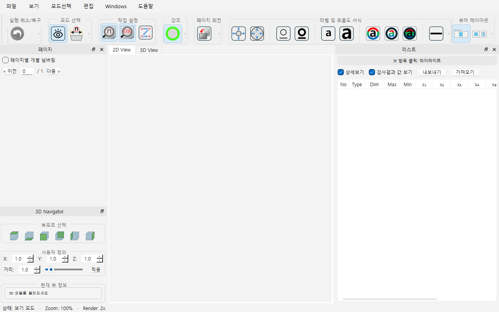
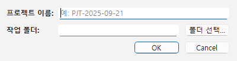

# TS Numbering Tool User Manual

## 1. Introduction
**TS Numbering Tool** is a specialized application for PDF numbering, stamping, and 3D visualization. It allows users to easily add numbered markers, stamps, and dimensions to PDF drawings.

## 2. Interface Overview

### Main Window

The main interface consists of:
- **Toolbar**: Quick access to common tools (Open, Save, Zoom, etc.).
- **PDF View**: The central area displaying the current PDF page.
- **Side Panel**: Contains the "Numbering List" and "Stamp List" for managing annotations.

## 3. Key Features

### 3.1 Creating a New Project
To start a new project:
1. Click on **File > New Project**.
2. Enter the project name and select the base PDF file.

### 3.2 Numbering
- **Add Number**: Click on the PDF where you want to add a number. The number will automatically increment.
- **Edit Number**: Double-click a number in the list or on the PDF to edit its value or style.

### 3.3 Stamping
- **Add Stamp**: Select a stamp from the toolbar and click on the PDF to place it.
- **Manage Stamps**: Use the Stamp Manager to import custom stamp images.

### 3.4 3D View
- If your project includes a 3D model, you can view it by switching to the **3D View** tab.
- Use the mouse to rotate, pan, and zoom the 3D model.

## 4. Troubleshooting
- **PDF not loading**: Ensure the PDF file is not corrupted and is not password protected.
- **Application crash**: Check the `tsn_error.log` file for error details.

---
*Generated for TS Numbering Tool v1.42*
